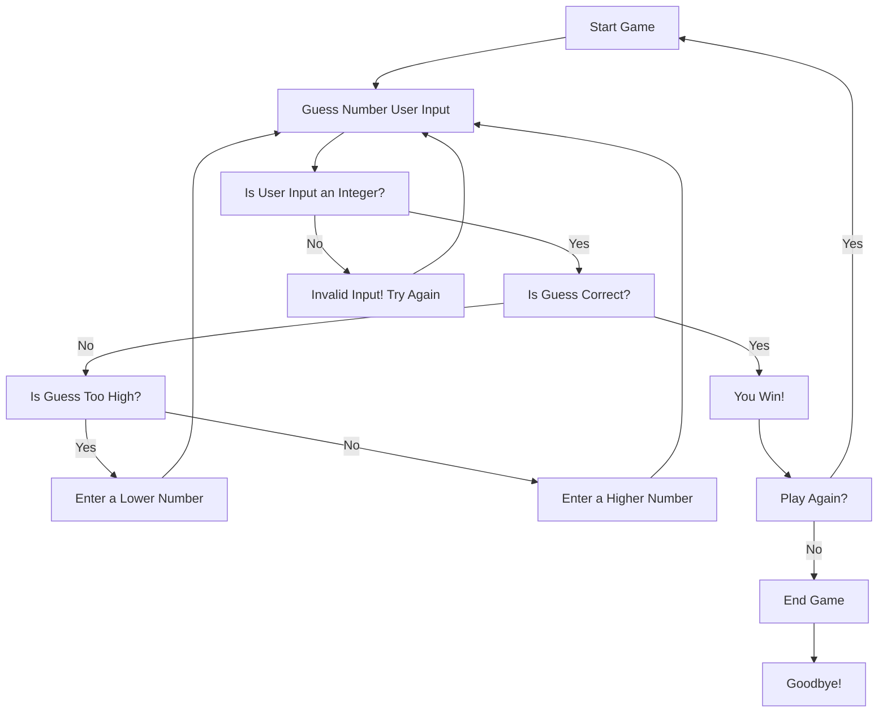

```mermaid
graph TD
    A[Start Game] --> B[Guess Number User Input]
    B --> C[Is User Input an Integer?]
    C -- Yes --> D[Is Guess Correct?]
    C -- No --> E[Invalid Input! Try Again]
    E --> B
    D -- Yes --> F[You Win!]
    D -- No --> G[Is Guess Too High?]
    G -- Yes --> H[Enter a Lower Number]
    G -- No --> I[Enter a Higher Number]
    H --> B
    I --> B
    F --> J[Play Again?]
    J -- Yes --> A
    J -- No --> K[End Game]
    K --> L[Goodbye!]
```
